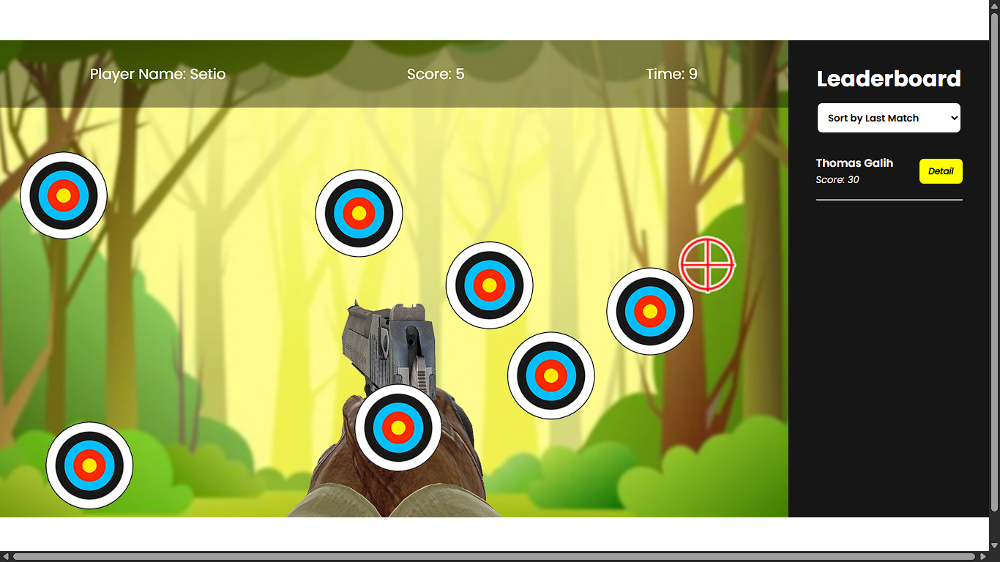

# 🔫 Shooter Game - Mini Game Web 2D Sederhana

---

## 📝 Deskripsi

**Shooter Game** adalah game 2D berbasis web dengan konsep sederhana di mana pemain mengendalikan pesawat atau karakter untuk **menembak musuh** yang muncul secara acak.  
Gameplay dibuat ringan, cepat, dan seru sebagai project latihan logika dasar game berbasis JavaScript.

Seluruh sistem dikembangkan menggunakan teknologi dasar **HTML, CSS, dan JavaScript** tanpa framework tambahan.  

---

## 🚀 Teknologi yang Digunakan

| Teknologi  | Deskripsi Singkat |
|------------|-------------------|
|  **HTML5** | Struktur utama canvas dan elemen halaman. |
|  **CSS3** | Styling sederhana untuk layout dan tampilan. |
|  **JavaScript** | Logic game, pergerakan, tembakan, collision detection, dan skor. |

---

## ✨ Fitur Utama

### 🎮 1. Gameplay Sederhana & Menantang
- Pemain bisa **menembak musuh** yang muncul acak.
- Skor bertambah sesuai jumlah musuh yang berhasil dikalahkan.

---

### 🚀 2. Animasi & Collision Detection
- Terdapat animasi tembakan, ledakan, dan pergerakan musuh.
- Sistem **collision detection** sederhana untuk mendeteksi tabrakan.

---

### 🌐 3. Responsive & Ringan
Game dapat dimainkan langsung melalui browser di **desktop maupun mobile** tanpa perlu instalasi.

---

## 🎯 **Tujuan Project**
- Melatih logika dasar pembuatan game dengan **canvas & JavaScript murni**.
- Meningkatkan pemahaman animasi, physics sederhana, dan event handling.
- Menciptakan game ringan yang cepat dimainkan di browser.

---

## 📝 Penutup
**Shooter Game** dibuat sebagai project latihan sederhana dalam pengembangan game web berbasis HTML, CSS, dan JavaScript dengan gameplay yang mudah dipahami namun tetap seru.

---
